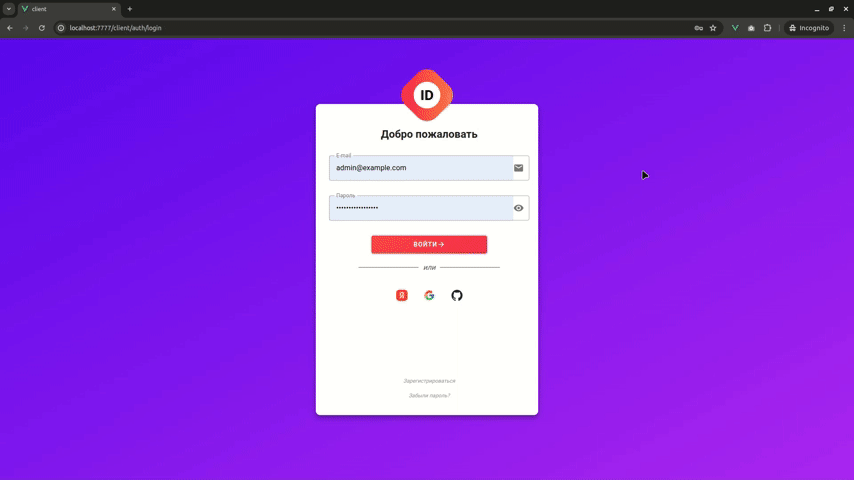
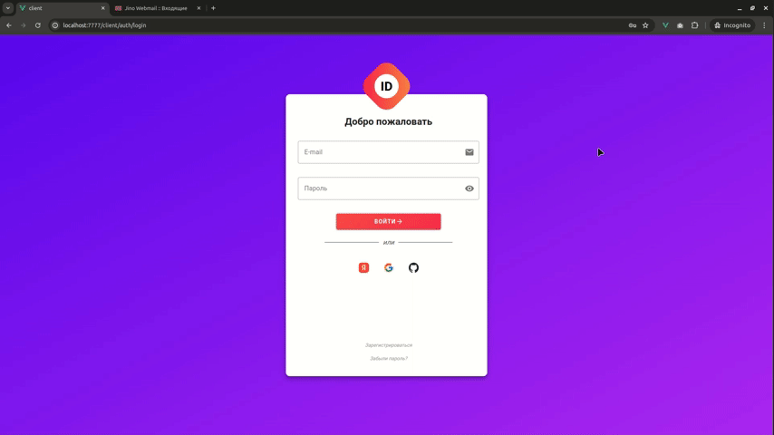
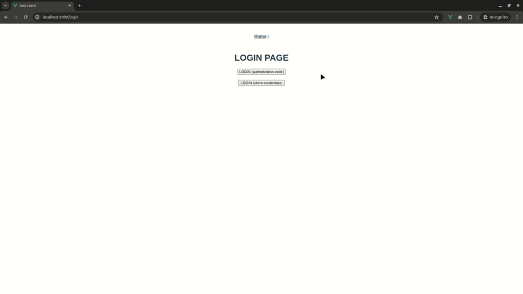

# Строим свой SSO сервер используя Spring Authorization Server

<p align="center">
    
</p>

На днях я решил сделать под все свои pet-проекты собственный SSO сервис, дабы не заморачиваться каждый раз с
авторизацией и аутентификацией. Возиться с этим особо долго мне не хотелось. Все таки это для pet-проектов. Поэтому
выбор пал на `Spring Security`. Мне давно уже было интересно посмотреть в действии как на `Spring Boot 3`, так и новый
`Spring Authorization Server` версии `1.x.x`. В данной статье речь пойдёт о проблемах и их решениях при построении
собственного SSO. А также я поставил себе ряд интересных требований, с которыми я постараюсь справиться и рассказать о
своём опыте.

### Часть 1: [Строим свой SSO сервер используя Spring Authorization Server](https://habr.com/ru/articles/737548/)

### Часть 2: [Строим свой SSO. PostgreSQL и ролевая модель](https://habr.com/ru/articles/746698/)

### Часть 3: [Строим свой SSO. Часть 3: Redis, Swagger, Vue.js](https://habr.com/ru/articles/748584/)

### Часть 4: [Строим свой SSO. Часть 4: Vue.js, Регистрация, Сброс пароля](https://habr.com/ru/articles/784552/)

## Структура репозитория

1. [j-sso](./j-sso/README.md) - SSO сервис, разработка которого рассматривается в статьях.
2. [j-service](./j-service/README.md) - пример OAuth2 ресурс сервера, который работает в паре с `j-sso`
3. [j-swagger-ui](./j-swagger-ui/README.md) - пример сервиса предоставляющего swagger-ui.
   Смотри [`Раздел 3.2 статьи`](https://habr.com/ru/articles/748584/)
4. [test-client](./test-client/README.md) - простой Vue.JS OAuth2 клиент. Используется в качестве приложения для
   демонстрации авторизации через `j-sso`

## Версии и используемые инструменты

Для работы приложения и ведения разработки вам потребуется:

1. Java 17
2. Node 16
3. Maven 3

Остальные версии используемых библиотек смотрите в [pom.xml](pom.xml).

## Сборка всех сервисов

Для сборки всех сервисов выполните команду:

```shell
clean install -DskipTests -P dev,client-build-and-copy
```

## Запуск в среде разработки

В каждом сервисе, в файле README описано как собрать и запустить приложение. Также для запуска доступны готовые
конфигурации для IntelliJ IDEA. Они находятся тут [runConfigurations](.idea/runConfigurations).

Также для запуска доступна подготовленная конфигурация docker compose ([docker-compose.yml](docker-compose.yml)).

Чтобы запустить сразу все сервисы и наслаждаться изучением их работы используйте подготовленные конфигурации IDEA:

- Шаг 0. Указать корректные значения environment variables для j-sso. (Ищи в
  файле [docker-compose.yml](docker-compose.yml) выражение `<set_value>`)
- Шаг 1. Запустить БД. Используйте конфигурацию [run_database.xml](.idea/runConfigurations/run_database.xml).
- Шаг 2. Накатить схему БД для j-sso. Перейдите в модуль j-sso и выполните следующую команду:
  ```shell
     mvn liquibase:update -Dliquibase.searchPath=./
   ```
- Шаг 3. Собрать и запустить все сервисы. Используйте конфигурацию
  запуска [run_all_services.xml](.idea/runConfigurations/run_all_services.xml). Она сделает сборку всего приложения и
  запустит все сервисы.

При запуске сервисов в docker контейнерах используйте подготовленные конфигурации для запуска отладчика:

- [Remote_debug_j_service.xml](.idea/runConfigurations/Remote_debug_j_service.xml)
- [Remote_debug_j_sso.xml](.idea/runConfigurations/Remote_debug_j_sso.xml)

## Скриншоты

#### Личный кабинет пользователя (администратора).



#### Регистрация пользователя



#### Вход с использованием j-sso (test-client)

